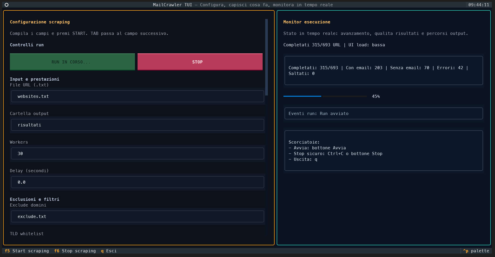
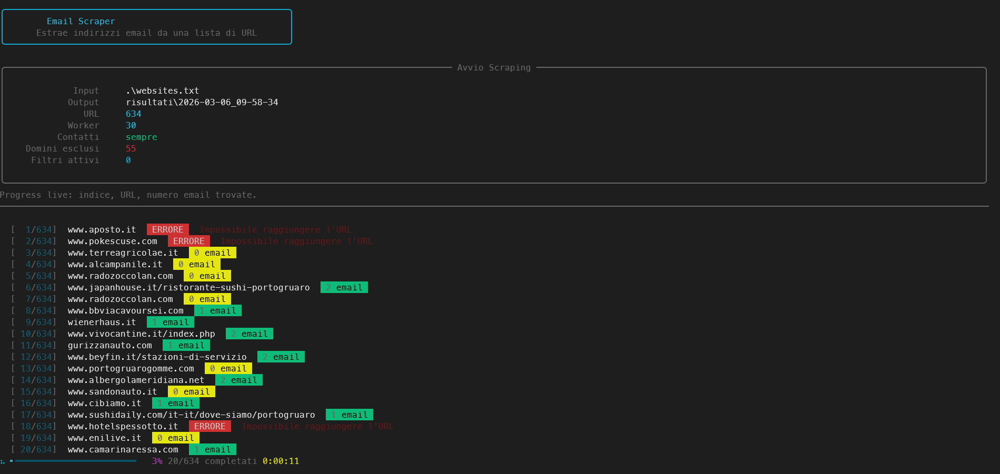

# Email Scraper

Python tool to extract email addresses from a list of websites.

It scans:
- `mailto:` links
- visible page text
- raw HTML
- obfuscated formats like `info [at] domain [dot] com`
- common contact/about pages

## Requirements

- Python `3.10+`
- Dependencies are auto-installed on first run:
  - `requests`
  - `beautifulsoup4`
  - `rich`
  - `textual`

## Run Modes

### CLI (recommended for best throughput)

```bash
python main.py websites.txt [options]
```

### TUI (Textual)

```bash
python main.py --tui
```

or simply:

```bash
python main.py
```

The TUI is now optimized for stability:
- compact runtime panel
- periodic counter updates (counter-only mode)
- event queues with backpressure/coalescing
- scraper executed in a separate process to keep UI responsive

Settings are persisted in `.mailcrawler_tui_settings.json`.

## Screenshots

### TUI View



### CLI View



## CLI Arguments

| Argument | Description |
|---|---|
| `input.txt` | Text file with one URL per line (required unless `--tui`) |

## Options

| Option | Description |
|---|---|
| `--tui` | Launch Textual UI |
| `--workers N` | Number of parallel workers (default: `5`) |
| `--delay N` | Extra per-thread delay in seconds (default: `0`) |
| `--no-contact-pages` | Check contact pages only if homepage has no emails |
| `--exclude DOMAIN ...` | Exclude one or more domains |
| `--exclude file.txt` | Exclude domains listed in a text file |
| `--output-dir DIR` | Base output directory (default: `risultati`) |
| `--include-any-at-text` | Permissive mode for any token containing `@` |
| `--tld-whitelist TLD ...` | Accept only listed TLDs (also from file) |
| `--use-common-tlds` | Enable built-in common TLD whitelist |
| `--max-tld-length N` | Reject emails with TLD longer than `N` |
| `--non-email-domain-blacklist DOMAIN ...` | Reject addresses from known non-contact domains |
| `--use-default-non-email-domains` | Enable built-in non-email domain blacklist |
| `--local-prefix-blacklist PREFIX ...` | Reject local-part prefixes like `noreply` |
| `--use-default-system-local-prefixes` | Enable built-in system prefixes blacklist |
| `--min-local-length N` | Minimum local-part length before `@` |
| `--ignore-non-content` | Ignore script/style/meta/comments/data-* |
| `--split-confidence` | Store reliable vs uncertain email groups |
| `--add-source-type` | Add `source_type` and `domain_distribution` |
| `--max-frequency N` | Reject emails repeated `>= N` times on same page |

## Examples

```bash
# Basic run
python main.py websites.txt

# Parallel run with 10 workers
python main.py websites.txt --workers 10

# Exclude domains from file
python main.py websites.txt --exclude excluded.txt

# Strict filtering + confidence split
python main.py websites.txt --use-common-tlds --ignore-non-content --split-confidence
```

## Output Files

Each run creates a timestamped directory:

```text
risultati/
  2026-03-06_09-35-35/
    output.json
    all_emails.txt
    no_email.txt
    errori.txt
    scraping_errors.log
```

### Status values

| Value | Meaning |
|---|---|
| `ok` | Emails found |
| `no_emails_found` | URL reachable but no email found |
| `error` | URL not reachable / request failure |
| `skipped` | Domain skipped via exclusion list |

## Performance Notes

In your current benchmark:
- CLI run: `372.3s`
- TUI run: `520.3s`

This is expected. CLI is faster because it has minimal rendering/event overhead.

TUI is designed for visibility and control, not absolute max throughput.

## Important TUI Warning (High Workers)

When using high worker counts in TUI (for example `20+`, especially `30+`):
- event volume increases significantly
- UI can become less responsive
- total runtime can be higher than CLI

Recommendations:
- for maximum speed: use CLI
- for monitoring/control: use TUI with moderate workers (for example `8-16`, machine dependent)
- if TUI feels slow, lower workers and keep CLI for large production runs

## Architecture Highlights

- Threaded scraping workers (`ThreadPoolExecutor`)
- Graceful stop handling (`Ctrl+C`, stop event)
- TUI process isolation:
  - scraper runs in a separate process
  - UI receives events via queues
  - result events are coalesced under pressure to avoid UI freeze
- Robust logging:
  - runtime errors: `risultati/<timestamp>/scraping_errors.log`
  - TUI diagnostics: `tui_debug.log`
